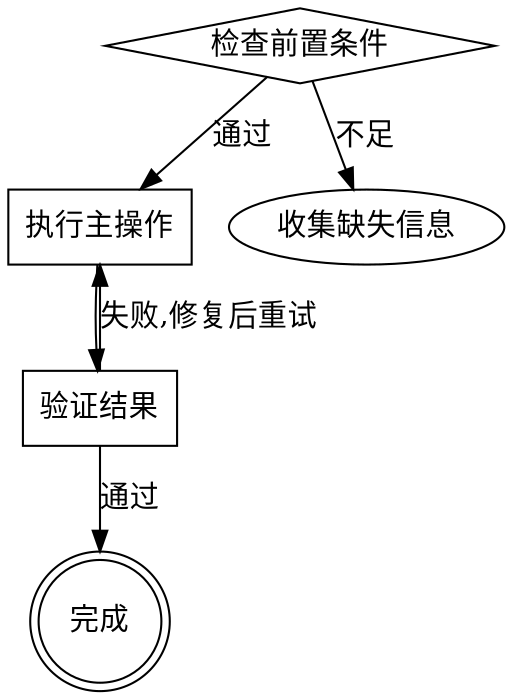

# Workflow 四种模式

## 1. 单步骤模式

适用:逻辑简单,主流程 ≤20 行可表达完整。

```markdown
# <Skill Name>

## Workflow

<完整步骤内联,无 Step 1/2/3 分层,无 references 子文件>

## Constraints

<inline 约束>
```

**示例:** 单次格式化、单次 lint、简单查询。

## 2. 多步骤模式

适用:流程有 ≥2 个有序阶段,每阶段独立可测。

```markdown
# <Skill Name>

## Workflow

### Step 1: <阶段名>

Read [references/step1-detail.md](references/step1-detail.md), 执行 X。

### Step 2: <阶段名>

Read [references/step2-detail.md](references/step2-detail.md), 执行 Y。

### Step 3: <阶段名>

调用 Write 输出 Z。

## Constraints

详见 [references/output-constraints.md](references/output-constraints.md)。
```

**示例:** code-review-single(顺序流程),build-and-deploy。

## 3. 分发判断模式

适用:流程含条件分支(if/else / switch),每分支走不同 references。

```markdown
# <Skill Name>

## Workflow

### Step 1: 收集输入

调用 Bash 脚本提取参数 → 读取 header 字段。

### Step 2: 分发判断

按 header `<KEY>` 字段路由(下方 `output-constraints.md` 即 progressive-disclosure.md 所称的"共享约束文件"):

- **<KEY> == A** → Read [references/branch-a.md](references/branch-a.md) 执行 A 流程
- **<KEY> == B** → Read [references/branch-b.md](references/branch-b.md) 执行 B 流程
- **<KEY> == C** → Read [references/branch-c.md](references/branch-c.md) 执行 C 流程

## Constraints

详见 [references/output-constraints.md](references/output-constraints.md)。
```

**示例:** code-review-single(SHARDS 决策),多语言代码生成器。

## 4. 流程图驱动模式

适用:流程含非线性判断、循环、回退或容易提前终止的步骤。

GraphViz DOT 格式嵌入 SKILL.md,比纯文本更稳定:

```markdown
# <Skill Name>

## Workflow



## Constraints

<约束>
```

**示例:** 多步骤创建流程(有条件回退)、诊断排错流程(分支 + 循环)。

> 复杂流程还需要编号检查表,要求 Agent 外化进度,否则 Agent 容易执行前几步后忘记后面的验证。

## 模式选择决策表

| 信号 | 建议模式 |
|---|---|
| 流程 ≤20 行,无分支 | 单步骤 |
| 流程 >20 行,纯顺序 | 多步骤 |
| 流程含 if/else 分支 | 分发判断 |
| 流程含循环、回退、非线性判断 | 流程图驱动 |
| 单流程 + 子模式扩展空间 | 多步骤(预留 references 接口) |

## 自动推断规则(供 Step 1 使用)

模型根据用户描述的 skill 用途,按以下规则自动选择模式,**无需向用户确认**:

### 判定逻辑

```
IF 用户描述含"根据 X 走不同流程" / "分类处理" / "路由" / 条件分支语义
  → 分发判断模式

ELSE IF 用户描述含循环/回退/重试/非线性判断(如"失败则回退重做" / "直到通过")
  → 流程图驱动模式

ELSE IF 用户描述的动作可拆为 ≥2 个有序阶段(如"先收集再生成再写入")
  → 多步骤模式

ELSE
  → 单步骤模式
```

### 自动推断后的处理

- 推断结果纳入 Step 2 的完整提案中展示,不单独确认
- 若用户在 Step 2 对模式有异议,可在"需要修改"中调整
