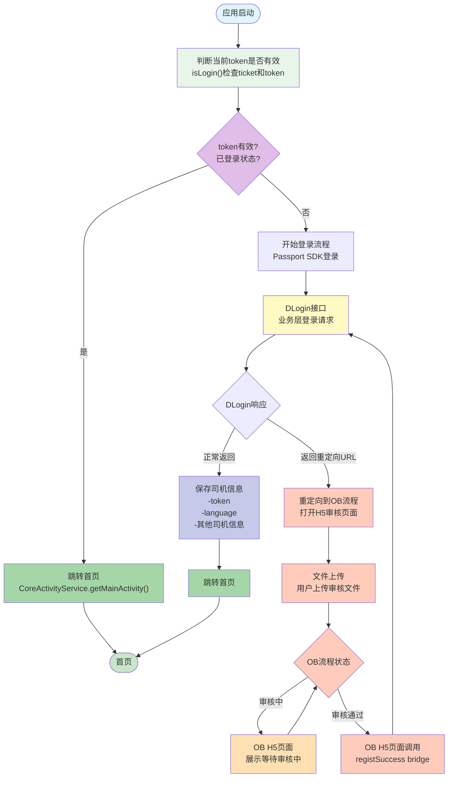

# 流程图转换规则详解

本文档详细说明如何将缩进格式的流程简述转换为 Mermaid 流程图。

## 功能说明

将缩进格式的流程简述自动转换为标准化的 Mermaid 流程图代码。输入格式使用缩进表示层级关系，输出为符合 Mermaid 语法规范的流程图代码。

## 核心转换指令

### 1. 解析缩进层级结构

- 根据缩进空格数识别流程层级关系
- 相同缩进级别表示同级节点
- 增加缩进表示子流程或分支

### 2. 节点类型识别规则

根据文本内容自动识别节点类型：

**判断节点（菱形 `{"文本"}`）**：
- 包含问号 `?` 的文本
- 包含"是否"、"有效/无效"、"是/否"等判断关键词
- 包含"判断"、"检查"等动词且后续有分支

**开始/结束节点（圆角矩形 `([文本])`）**：
- 包含"启动"、"开始"、"结束"、"首页"、"完成"等关键词
- 流程的起始和终止节点

**普通操作节点（矩形 `["文本"]`）**：
- 其他所有步骤和操作

### 3. 流程图配置

- **方向**：固定使用 `flowchart TD`（从上到下）
- **文本换行**：使用 `<br/>` 处理长文本换行
- **条件分支**：使用 `-->|标签|` 表示条件分支，标签从流程简述中提取（如"是"、"否"、"有效"、"无效"等）

### 4. 样式生成规则

自动为相似业务流程节点分配相同颜色，确保视觉一致性：

- **开始节点**：`#e1f5ff`（浅蓝色）
- **结束节点**：`#c8e6c9`（浅绿色）
- **判断节点**：`#e1bee7`（浅紫色）
- **关键操作**：`#fff9c4`（浅黄色）
- **流程节点**：`#ffccbc`（浅橙色）
- **等待状态**：`#ffe0b2`（浅棕色）
- **信息保存**：`#c5cae9`（浅蓝紫色）
- **跳转操作**：`#a5d6a7`（浅绿色）

相似业务流程节点（如多个"跳转首页"操作）应使用相同颜色。

## 转换规则详解

### 缩进层级映射

- **缩进层级** → 流程图节点层级
- 第一层（无缩进）→ 流程起始节点
- 每增加一层缩进 → 增加一个节点层级
- 同级缩进 → 同级节点或分支

### 关键词识别

**条件判断关键词**（转换为菱形判断节点）：
- "是否"、"有效/无效"、"是/否"、"判断"、"检查"（后跟分支）

**开始/结束关键词**（转换为圆角矩形节点）：
- "启动"、"开始"、"结束"、"首页"、"完成"、"终止"

**条件分支标签**（用于边的标签）：
- "是"、"否"、"有效"、"无效"、"通过"、"失败"等

### 节点命名规则

- 使用有意义的节点ID（如 `Start`、`CheckToken`、`IsValid`）
- 节点ID使用驼峰命名法
- 确保节点ID唯一

## 转换步骤

1. **解析输入**：读取流程简述，识别缩进层级
2. **构建节点树**：根据缩进构建层级结构
3. **识别节点类型**：根据关键词识别节点类型
4. **生成Mermaid代码**：
   - 生成 `flowchart TD` 声明
   - 生成节点定义（严格遵守语法规则）
   - 生成连接关系
   - 生成样式定义
5. **语法检查**：确保所有文本都用双引号包裹，没有Markdown语法，列表标记后无空格

## 输出格式示例



## 使用示例

**输入（流程简述）**：
```
应用启动 
    判断当前token是否有效，有效即为已登陆状态
        跳转首页。
    未登陆状态/token无效
        开始登陆流程
            Dlogin接口
                返回重定向url
                    重定向到OB流程
                        文件上传，OB审核中
                            ob h5页面 展示等待审核中 
                        文件上传，OB流程审核通过
                            ob h5页面可调用registSuccess bridge
                                app再次调用Dlogin接口
                正常返回。保存司机token language等信息。
                    跳转首页。
```

**输出**：符合上述格式的 Mermaid 流程图代码，严格遵守所有语法规则。

## 注意事项

1. **语法检查**：在生成代码前，必须检查所有文本元素是否符合三条语法规则
2. **文本清理**：移除Markdown语法，处理列表标记后的空格
3. **双引号包裹**：所有文本内容必须用双引号包裹，无论是否包含空格
4. **节点ID唯一性**：确保每个节点有唯一的ID
5. **样式一致性**：相似业务流程节点使用相同颜色

