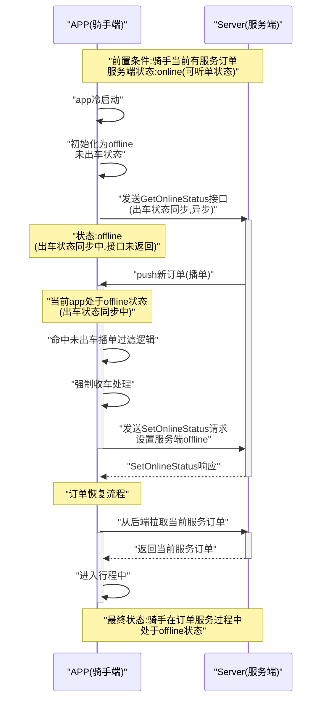

# 时序图转换规则详解

本文档详细说明如何将业务链路描述转换为 Mermaid 时序图（Sequence Diagram）。

## 功能说明

将业务场景描述、交互链路和动作步骤自动转换为标准化的 Mermaid 时序图代码。输入格式包含业务场景、交互实体、前置条件、动作步骤等信息，输出为符合 Mermaid 语法规范的时序图代码。

## 核心转换指令

### 1. 识别实体 (Participants)

首先，从用户输入中明确参与交互的所有角色。这些角色将成为时序图中的参与者（participants）。

**识别方法**：
- 从"核心交互实体"、"参与者"、"实体"等部分提取
- 从业务场景描述中推断（如"APP"、"服务端"、"Server"等）
- 为每个实体创建 `participant` 声明，使用有意义的别名

**示例**：
```mermaid
participant APP as "APP(骑手端)"
participant Server as "Server(服务端)"
```

### 2. 分析动作链路 (Analyze Steps)

按顺序分析"交互链路/动作步骤"中的每一个动作，确保按照时间顺序排列。

### 3. 区分动作类型 (Crucial Distinction)

这是最重要的指令。必须准确区分两种动作类型：

**自引用箭头**（实体内部处理）：
- 对于一个实体**内部的逻辑处理、状态变化或自我初始化**（即动作的发起方和接收方是同一个实体），必须使用**自引用箭头**来表示。
- 语法：`实体->>实体: "动作描述"`
- 示例：`APP->>APP: "初始化本地状态"`

**标准箭头**（实体间通信）：
- 对于实体之间的**通信、请求或数据推送**，必须使用**标准箭头**来表示。
- 语法：`实体1->>实体2: "请求/消息"` 或 `实体2-->>实体1: "响应"`
- 示例：`APP->>Server: "请求同步状态"`、`Server-->>APP: "返回数据"`

**箭头类型说明**：
- `->>`：同步请求/消息（实线箭头）
- `-->>`：异步响应/返回（虚线箭头）

### 4. 善用备注 (Use Notes)

使用 `Note` 语法来清晰地标注关键信息：

**前置条件/初始状态**：
```mermaid
Note over 实体1,实体2: "前置条件:描述内容"
```

**关键步骤的解释说明**：
```mermaid
Note over 实体: "说明文字"
```

**最终状态**：
```mermaid
Note over 实体1,实体2: "最终状态:描述内容"
```

**注意事项**：
- 使用 `<br/>` 处理多行备注
- 所有文本必须用双引号包裹
- 备注内容不应包含 Markdown 语法

### 5. 表示处理过程 (Use Activations)

在适当的时候使用 `activate` 和 `deactivate` 来表示一个实体在处理某个请求时的"激活"状态（生命线），使图表更具可读性。

**使用规则**：
- 在实体开始处理请求时使用 `activate 实体`
- 在实体完成处理时使用 `deactivate 实体`
- 对于自引用操作，通常也需要激活状态
- 确保每个 `activate` 都有对应的 `deactivate`

**示例**：
```mermaid
APP->>Server: "发送请求"
activate Server
Server-->>APP: "返回响应"
deactivate Server
```

## 转换步骤

1. **解析输入**：识别业务场景、交互实体、前置条件、动作步骤、最终状态
2. **识别实体**：提取所有参与交互的角色，创建 participant 声明
3. **分析动作链路**：按时间顺序分析每个动作步骤
4. **区分动作类型**：判断每个动作是自引用还是实体间通信
5. **生成Mermaid代码**：
   - 生成 `sequenceDiagram` 声明
   - 生成 participant 声明
   - 生成前置条件 Note
   - 生成动作序列（严格遵守语法规则）
   - 生成最终状态 Note
6. **语法检查**：确保所有文本都用双引号包裹，没有Markdown语法，列表标记后无空格

## 输出格式示例



## 使用示例

**输入（业务链路描述）**：
```
发生场景：
当前服务端状态：
- 骑手当前有服务订单
- 骑手处于online（可听单状态）

链路：
1. app冷启动 
2. 初始化为offline，未出车状态。 
3. app 出车状态同步：发送接口 GetOnlineStatus。该过程为异步过程，接口未返回时，状态未同步。
4. 服务端push 新订单（播单）。 
5. 由于当前app 处于 offline 状态 (出车状态同步中)，命中【未出车播单过滤逻辑】
6. 未出车播单过滤逻辑中，强制收车，发送SetOnlineStatus请求，设置服务端offline。
7. 订单恢复流程。从后端拉去当前服务订单。进入行程中。

最后： 骑手在订单服务过程中，处于offline状态。
```

**输出**：符合上述格式的 Mermaid 时序图代码，严格遵守所有语法规则。

## 注意事项

1. **动作类型区分**：必须准确区分自引用箭头和标准箭头，这是时序图正确性的关键
2. **激活状态管理**：确保每个 activate 都有对应的 deactivate，避免图表混乱
3. **备注使用**：善用 Note 来标注前置条件、关键说明和最终状态
4. **语法检查**：确保所有文本都用双引号包裹，没有Markdown语法，列表标记后无空格
5. **时间顺序**：严格按照时间顺序排列动作，确保流程逻辑清晰

## 常见模式

### 模式1：请求-响应模式
```mermaid
Client->>Server: "请求"
activate Server
Server-->>Client: "响应"
deactivate Server
```

### 模式2：内部处理模式
```mermaid
APP->>APP: "初始化状态"
activate APP
APP->>APP: "处理逻辑"
deactivate APP
```

### 模式3：异步推送模式
```mermaid
Server->>APP: "推送消息"
activate APP
APP->>APP: "处理推送"
deactivate APP
```

### 模式4：条件分支模式
使用 Note 标注条件，或使用 alt/opt 语法（如果 Mermaid 支持）：
```mermaid
Note over APP: "条件判断"
APP->>Server: "请求A"
Note over APP: "其他条件"
APP->>Server: "请求B"
```

